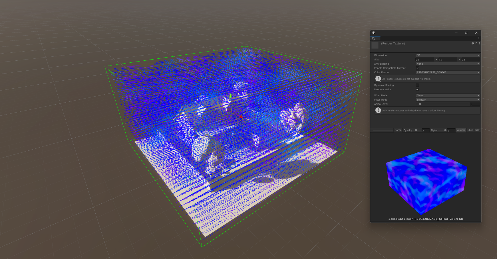
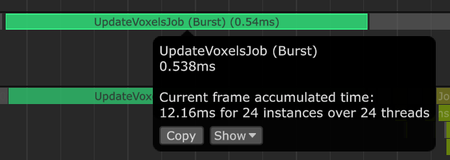

# Voxel Wind
A voxel-based wind system for Unity with hight-quality and performance. This project is inspired by the [Wind Simulation in God of War](https://youtu.be/dDgyBKkSf7A?si=sw-8u-IgqSBL8KIn)

Documentation is under way.

## About Voxel Wind
The Voxel-Based Wind Simulation System is an advanced computational model designed to simulate and visualize the complex behaviors of wind currents within a three-dimensional space. Utilizing a grid of voxels, this system meticulously calculates the movement of air through various environments, accounting for factors such as direction, speed, and interactions with obstacles and local wind zones.

Voxel wind system solves the the mathematically complex problem of simulating wind in a way that is both visually appealing and computationally efficient. By breaking down the environment into a grid of voxels, the system can accurately model the movement of air through the space, creating realistic wind currents that interact with the environment in a natural and dynamic way.

This package is developed HDRP, but should work with other render pipelines as well since it doesn't rely on any specific rendering features.

## Installation
Go to Window->Package Manager, click on the + sign and Add from git: https://github.com/misakieku/VoxelWind.git

## Getting Started
1. Import the Voxel Wind package into your Unity project.
2. Add the Voxel Wind component to your scene.
3. Adjust the settings to customize the wind simulation.

### Package Dependency
1. [Burst](https://docs.unity3d.com/Packages/com.unity.burst@1.8/manual/index.html)
2. [Mathematics](https://docs.unity3d.com/Packages/com.unity.mathematics@1.3/manual/index.html)

## Features
- [X] CPU simulation using burst compiler.
- [X] GPU simulation using compute shader.
- [X] Debug visualization.
- [X] 3D render texture packing for CPU simulation.
- [X] Global wind motor.
- [X] Local wind motor.
- [ ] Nice editor.
- [ ] Performance optimization.
- [ ] Fuction for shader sampling.
- [ ] Pressure simulation.

## Performance
Benchmarked on a Windows 11 PC with an Intel Core i7-13700k CPU and an NVIDIA GeForce RTX 4070 ti GPU.

Data captured using Unity Profiler, GPU timing may not be accurate.

### Benchmark Settings
- Voxel Size: 1
- Grid Size: 32x16x32
- Voxel Count: 16384
- Global Wind Motor: 3
    - Directional Wind: 1
    - Turbulence: 2
- Local Wind Motor: 1
    - Vortex: 1
- Wind Collider: 1

### CPU Simulation

### GPU Simulation
